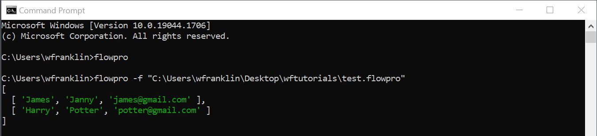
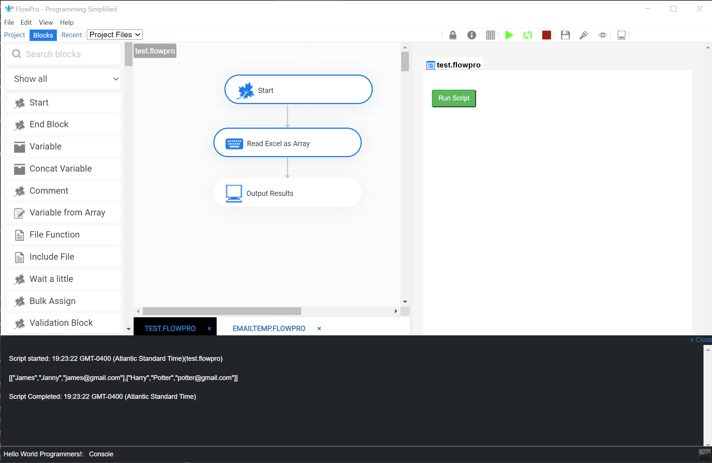

# flowpro-cli
FlowPro for CLI

## Steps

Install flowpro using [npm](https://www.npmjs.com/package/flowpro-cli) 

```
npm install -g flowpro-cli
```

Run using the flowpro command

```
flowpro -f "path-to-flowpro-file"
```

Command Line


UI version
